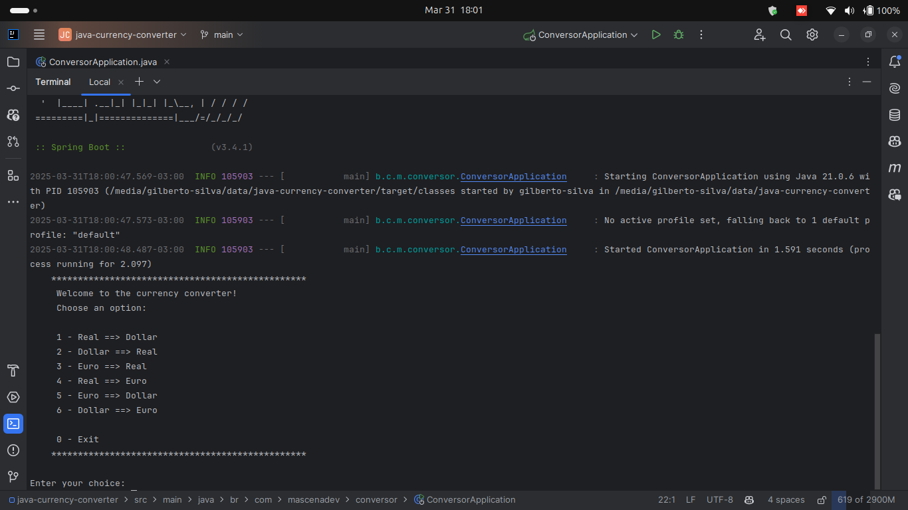

[English](https://github.com/Gilberto-Mascena/conversor-de-moedas-java/blob/main/README-en.md) |
[Português Brasileiro](https://github.com/Gilberto-Mascena/conversor-de-moedas-java/blob/main/README.md)


[](https://github.com/Gilberto-Mascena/java-currency-converter/actions)
[](https://github.com/Gilberto-Mascena/java-currency-converter/blob/main/LICENSE.md)
[](https://github.com/Gilberto-Mascena/java-currency-converter/stargazers)
[](https://github.com/Gilberto-Mascena/java-currency-converter/issues)
[](https://github.com/Gilberto-Mascena/java-currency-converter/releases)


# Challenger ONE - Java Back-end Training

## 🚀 About the Project

### This project is part of the ONE Java Back-end Developer Training challenge.

#### The goal is to develop a currency converter that allows conversions between different currencies using the ExchangeRate-API service. The application is built in Java 21, using the Spring Boot framework, and runs on the command line.

##### 🔹 Features

- Converts between different currencies in real time.
- Uses the ExchangeRate-API for fetching live exchange rates.
- Command-line interface for ease of use.
- Implements at least six currency conversion options.

##### 🔹 Available Conversion Options

#### The application supports the following currency conversions:

✅ BRL (Real) ➝ USD (Dollar)\
✅ USD (Dollar) ➝ BRL (Real)\
✅ EUR (Euro) ➝ BRL (Real)\
✅ BRL (Real) ➝ EUR (Euro)\
✅ EUR (Euro) ➝ USD (Dollar)\
✅ USD (Dollar) ➝ EUR (Euro)

## 🛠️ Technologies Used


- [Java 21](https://www.oracle.com/br/java/technologies/downloads/)
- [Spring Boot](https://spring.io/projects/spring-boot)
- [Maven](https://maven.apache.org/)
- [Git](https://git-scm.com/)

## 📌 Requirements

#### Before running the project, make sure you have installed:

- [Java 21 or higher](https://www.oracle.com/br/java/technologies/downloads/)
- [Maven](https://maven.apache.org/)
- [Git](https://git-scm.com/)
- Account on the API [ExchangeRate-API](https://www.exchangerate-api.com/), and generate a key to consume the API

## 🚀 How to Run the Project

1️⃣ Clone the Repository

If you are logged into GitHub:
```
git clone git@github.com:Gilberto-Mascena/java-currency-converter.git
```
If you are not logged into GitHub:
```
git clone https://github.com/Gilberto-Mascena/java-currency-converter.git
```
2️⃣ Open the Project in an IDE

Use an IDE of your choice, such as IntelliJ IDEA, Eclipse, or VS Code.

3️⃣ Set Up the API Key

In the root folder of the project, create a .env file and add the following content: ``API_KEY_EXCHANGE_RATE_API="your_api_key_here"``

Save the file!

4️⃣ Run the Application

Open a terminal in the project directory and execute:
```
mvn spring-boot:run
```

## 📸 Screenshot of the Running Project



## Project badge


## 📜 *License*

*This project is licensed under the MIT License. See more details at:* [_LICENSE.md_](./LICENSE.md)

## Gilberto | Dev _2024_