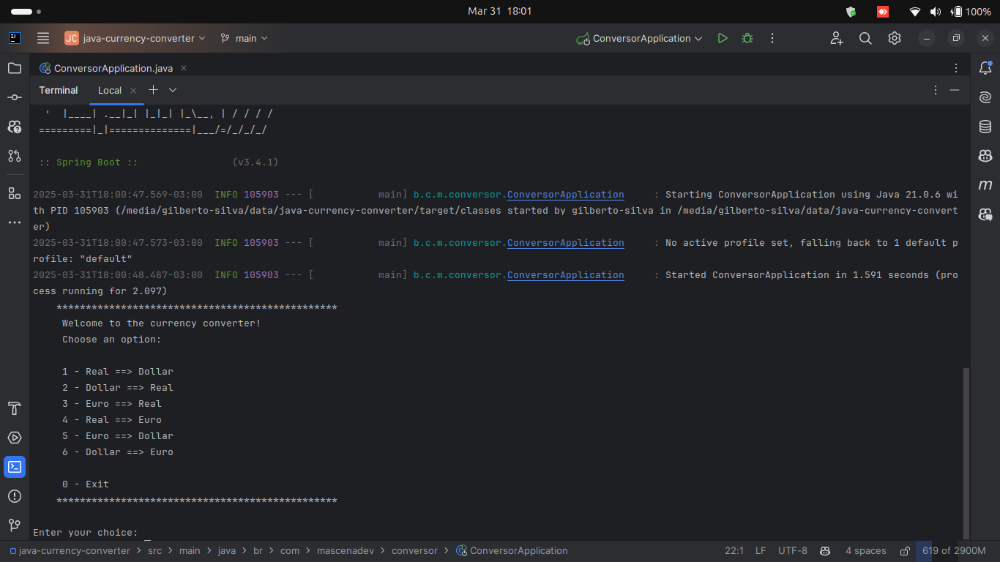
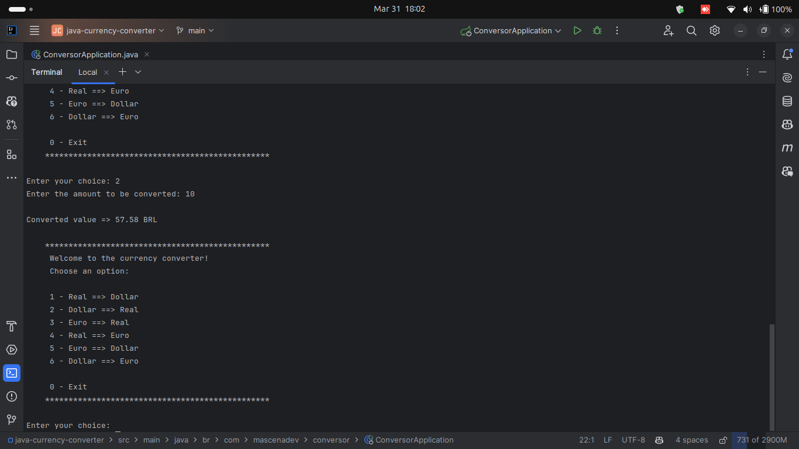

[Português Brasileiro](https://github.com/Gilberto-Mascena/conversor-de-moedas-java/blob/main/README.md) |
[English](https://github.com/Gilberto-Mascena/conversor-de-moedas-java/blob/main/README-en.md)


[](https://github.com/Gilberto-Mascena/java-currency-converter/actions)
[](https://github.com/Gilberto-Mascena/java-currency-converter/blob/main/LICENSE.md)
[](https://github.com/Gilberto-Mascena/java-currency-converter/stargazers)
[](https://github.com/Gilberto-Mascena/java-currency-converter/issues)
[](https://github.com/Gilberto-Mascena/java-currency-converter/releases)


# Challenger ONE - Treinamento Java Back-end

## 🚀 Sobre o Projeto

### Este projeto faz parte do desafio ONE Java Back-end Developer Training.

#### O objetivo é desenvolver um conversor de moeda que permita conversões entre diferentes moedas usando o serviço ExchangeRate-API. O aplicativo é construído em Java 21, usando o framework Spring Boot, e roda na linha de comando.

##### 🔹 Recursos

- Converte entre diferentes moedas em tempo real.
- Usa o ExchangeRate-API para buscar taxas de câmbio ao vivo.
- Interface de linha de comando para facilidade de uso.
- Implementa pelo menos seis opções de conversão de moeda.

##### 🔹 Opções de conversão disponíveis

#### O aplicativo suporta as seguintes conversões de moeda:

✅ BRL (Real) ➝ USD (Dólar)\
✅ USD (Dólar) ➝ BRL (Real)\
✅ EUR (Euro) ➝ BRL (Real)\
✅ BRL (Real) ➝ EUR (Euro)\
✅ EUR (Euro) ➝ USD (Dólar)\
✅ USD (Dólar) ➝ EUR (Euro)

## 🛠️ Tecnologias usadas
- [Java 21](https://www.oracle.com/br/java/technologies/downloads/)
- [Spring Boot](https://spring.io/projects/spring-boot)
- [Maven](https://maven.apache.org/)
- [Git](https://git-scm.com/)

## 📌 Requisitos

#### Antes de executar o projeto, certifique-se de ter instalado:

- [Java 21 ou superior](https://www.oracle.com/br/java/technologies/downloads/)
- [Maven](https://maven.apache.org/)
- [Git](https://git-scm.com/)
- Conta na API [ExchangeRate-API](https://www.exchangerate-api.com/), e gere uma chave para consumir a API

## 🚀 Como executar o projeto

1️⃣ Clone o repositório

Se você estiver logado no GitHub:
```
    git clone git@github.com:Gilberto-Mascena/java-currency-converter.git     
```
Se você não estiver conectado ao GitHub:
```
    git clone https://github.com/Gilberto-Mascena/java-currency-converter.git
``` 
2️⃣ Abra o Projeto em um IDE

Use um IDE de sua escolha, como IntelliJ IDEA, Eclipse ou VS Code.

3️⃣ Configure a Chave de API

Na pasta raiz do projeto, crie um arquivo .env e adicione o seguinte conteúdo: ``API_KEY_EXCHANGE_RATE_API="sua_chave_api_aqui"``

Salve o arquivo!

4️⃣ Execute o Aplicativo

Abra um terminal no diretório do projeto e execute:
```
    mvn spring-boot:run
```

## 📸 Captura de tela do projeto em execução


----


## *Badge do projeto*


## 📜 *Licença*

*Este projeto é licenciado sob a Licença MIT. Veja mais detalhes em:* [_LICENSE.md_](./LICENSE.md)

### Gilberto | Dev _2024_
